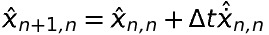
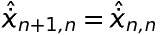
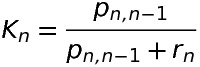
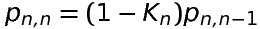
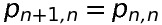

# SLAM
SLAM (Simultaneous Localization And Mapping) is the process of creating a map of an environment while tracking the agent's location within it.

>SLAM is a framework for temporal modeling of states that is commonly used in autonomous navigation. It is heavily based on principles of probability, making inferences on posterior and prior probability distributions of states and measurements and the relationship between the two. [1]

## Step 1: Prediction
We estimate our current position with a motion model by using previous positions, the current control input, and noise.

## Step 2: Measurement
Then, in the measurement step, we correct our prediction by using data from our sensors.

**Proprioceptive sensors** measure internal values - like acceleration, motor speeds, battery voltage, etc. For this project, I'll be simulating an inertial measurement unit by taking discrete measurement of artificially noisy (possibly systematic noise) linear and angular acceleration data.

**Exteroceptive sensors** collect data about the robot's environment, like distances to objects, light, sound, etc. For this project, I'll be simulating a collection of distance sensors by casting rays out from a "sensor" and recording the distances they travel.

## Kalman Filters

Kalman Filters are a way for us to estimate the (unknown) actual state of an system (our agent's position and orientation) through the collection of noisy data.

We can give more weight to data that we know is more accurate by increasing the Kalman Gain associated with that measurement.

We take the state of a system and use a set of equations (ex. laws of physics) to extrapolate a predicted future state.

| Notation | Meaning |
| -------- | ------- |
| ****     | is the true value |
|    | is the measurement value of the weight at time  |
|  | is the estimate of  at time  (the estimate is made after taking the measurement )|
| ![hat{x}_{n, n - 1}]  | is the previous estimate of ![x] that was made at time ![n-1] (the estimate was made after taking the measurement ![z_n-1])   |
| ![hat{x}_{n + 1, n}]  | is the estimate of the future state (![n+1]) of ![x]. The estimate is made at the time ![n], right after the measurement ![z_n]. In other words, ![x_{n, n+1}] is a predicted state  |

[n-1]: https://latex.codecogs.com/svg.latex?\inline&space;\LARGE&space;n-1
[n+1]: https://latex.codecogs.com/svg.latex?\inline&space;\LARGE&space;n+1
[n]: https://latex.codecogs.com/svg.latex?\inline&space;\LARGE&space;n
[x]: https://latex.codecogs.com/svg.latex?\inline&space;\LARGE&space;x_
[z_n]: https://latex.codecogs.com/svg.latex?\inline&space;\LARGE&space;z_n
[z_n-1]: https://latex.codecogs.com/svg.latex?\inline&space;\LARGE&space;z_n-1
[hat{x}_{n, n}]: https://latex.codecogs.com/svg.latex?\inline&space;\dpi{200}\large&space;\hat{x}_{n,&space;n}
[hat{x}_{n, n - 1}]: https://latex.codecogs.com/svg.latex?\inline&space;\dpi{300}\large&space;\hat{x}_{n,&space;n-1}
[hat{x}_{n + 1, n}]: https://latex.codecogs.com/svg.latex?\inline&space;\dpi{300}\large&space;\hat{x}_{n+1,&space;n}
[x_{n, n+1}]: https://latex.codecogs.com/svg.latex?\inline&space;\dpi{300}\large&space;x_{n,&space;n+1}

 <b> The Five Kalman Filter Equations: </b> 

State Update Equation:
 

 
State Update Equation Description

State Extrapolation Equations:
 

 

 
State Extrapolation Equation 1 Description
 s
State Extrapolation Equation 2 Description

Kalman Gain Equation:
 

 
Kalman Gain Equation Description

Covariance Update Equation
 

 
Covariance Update Equation Description

Covariance Extrapolation Equation
 

 
Covariance Extrapolation Equation  Description

Next, we take a measurement, tweak our estimation of the state, and then once again predict the future state.

# Sources & Resources
1. [How does Autonomous Driving Work? An Intro into SLAM](https://towardsdatascience.com/slam-intro-fd833ef29e4e)
2. [Simultaneous Localization and Mapping](https://en.wikipedia.org/wiki/Simultaneous_localization_and_mapping)
3. [MatLab: Understanding Kalman Filters](https://www.youtube.com/watch?v=mwn8xhgNpFY&list=PLn8PRpmsu08pzi6EMiYnR-076Mh-q3tWr)
4. https://www.kalmanfilter.net/default.aspx
